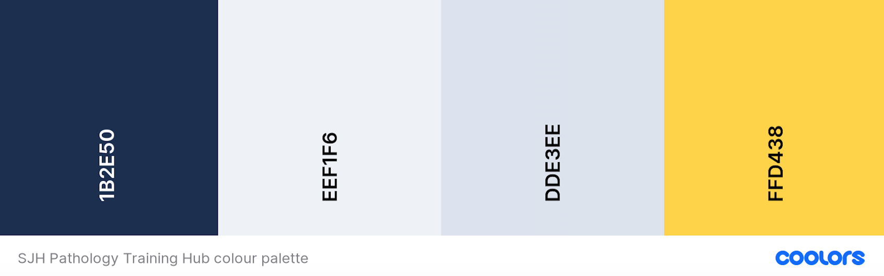

['CSS3 ribbon menu'](https://codepen.io/dodozhang21/pen/jkgDe) (CodePen)

['Microscope slide on a hand'](https://www.123rf.com/photo_39942689_microscope-slide-on-a-hand.html) (Copyright: [luchschen on 123RF](https://www.123rf.com/profile_luchschen))

['Photo Of Woman Looking Through Camera'](https://www.pexels.com/photo/photo-of-woman-looking-through-camera-5726794/) (Credit: [Artem Podrez on Pexels](https://www.pexels.com/@artempodrez))

['Clear Plastic Vials With Blue and Clear Liquid'](https://www.pexels.com/photo/clear-plastic-vials-with-blue-and-clear-liquid-7722797/) (Credit: [Tara Winstead on Pexels](https://www.pexels.com/@tara-winstead))

['Close up photo of hand in blue glove handing histological liver tissue sample'](https://www.123rf.com/photo_98440053_close-up-photo-of-hand-in-blue-glove-handing-histological-liver-tissue-sample.html?vti=nywuvmaul30v8odx0h-1-7) (Copyright: [vshivkova on 123RF](https://www.123rf.com/profile_vshivkova))

['Concept of Education anatomy and Human lung tissue under microscope, The lungs is organs of the respiratory system in humans.'](https://www.123rf.com/photo_119354162_concept-of-education-anatomy-and-human-lung-tissue-under-microscope-the-lungs-is-organs-of-the-respi.html?vti=o5qocd2qmpwfpukpxf-1-29) (Copyright: [sinhyu on 123RF](https://www.123rf.com/profile_sinhyu))

['Close-up image of laboratory scientist is working with microscope. Doing lab investigation.'](https://www.123rf.com/photo_92165880_close-up-image-of-laboratory-scientist-is-working-with-microscope-doing-lab-investigation-.html?vti=o5qocd2qmpwfpukpxf-1-5) (Copyright: [4pmproduction on 123RF](https://www.123rf.com/profile_4pmproduction))

['Pure CSS Tabs'](https://codepen.io/markcaron/pen/MvGRYV) ([Mark Caron on CodePen](https://codepen.io/markcaron))

['Featured Tabs'](https://codepen.io/RGonyeau/pen/Mvrzxx) ([Richard Gonyeau on CodePen](https://codepen.io/RGonyeau))

['A CSS-only Carousel Slider'](https://codepen.io/Schepp/pen/WNbQByE) ([Christian Schaefer on CodePen](https://codepen.io/Schepp) - h/t [CSS-Tricks](https://css-tricks.com/css-only-carousel/))

['Auto-placement in CSS Grid Layout'](https://developer.mozilla.org/en-US/docs/Web/CSS/CSS_Grid_Layout/Auto-placement_in_CSS_Grid_Layout) (MDN Web Docs)

['Responsive Vertical Tabs For Bootstrap 4'](https://github.com/tromgy/bootstrap-4-vertical-tabs) - h/t [CSS Script](https://www.cssscript.com/vertical-tabs-bootstrap/))

https://www.pathologyoutlines.com/dw/mystery201601.jpg

https://www.adelaidereview.com.au/app/uploads/2020/06/pathology-shutterstock_761873638-2048x1152.jpg

['Pure CSS Accordion'](https://codepen.io/raubaca/pen/PZzpVe) ([Raúl Barrera on CodePen](https://codepen.io/raubaca))

['CSS: Images - 45° grid gallery](https://www.linkedin.com/learning/css-images/2397415) (Morten Rand-Hendriksen on LinkedIn Learning)

---


# SJH Pathology Training Hub


#### [Live link to deployed project](http://loosenthedark.tech/sjh-pathology-training-hub/)


## User Experience (UX)

## Project design

### Colour scheme:

<details>
  <summary>
  <b>click to view</b>
  </summary>



</details>

### Typography:

<details>
  <summary>
  <b>click to view</b>
  </summary>

The official Tokyo 2020 font was developed by [Morisawa](https://olympics.com/tokyo-2020/en/news/morisawa-official-font-tokyo-2020), a Japanese type foundry, and appears to be unavailable for public use. After a bit of digging, I therefore decided to use the [Freeroad Regular font](https://webfonts.ffonts.net/Freeroad-Regular.font), which is a close approximation of the ["industrial `sans serif`"](https://fontmeme.com/images/TOKYO-2020-NEW.gif) seen in the Games' [(redesigned)](https://www.theguardian.com/sport/2016/apr/25/tokyo-2020-organisers-unveil-new-logo-olympic-plagiarism-allegations) [logo](https://fontmeme.com/images/TOKYO-2020-NEW.gif), for all primary headings across the site. To complement this, I chose [Raleway](https://fonts.google.com/specimen/Raleway?query=raleway), a popular `sans serif` font available via Google Fonts, as the default `body` font.

</details>

### Wireframes:

<details>
  <summary>
  <b>click to view</b>
  </summary>

</details>

## Features

### Existing features:

- #### [Landing page:](https://going-for-gold.netlify.app/)
<details>
  <summary>
  <b>click to view</b>
  </summary>

As showcased in the [images above](#going-for-gold), the first thing the user sees upon landing is a visually appealing Olympic rings logo animation (lasting approximately four seconds), followed by a further trickle-down/fade-in animation effect involving a trio of call-to-action buttons (one representing each Olympic medal category of gold ('MEDALLISTS'), silver ('ABOUT') and bronze ('CONTACT')). These three buttons are centred on all screen sizes, and act as de facto navigational aids in lieu of the site's actual navigation menu (which has been hidden here in an effort not to overload visitors with too much information within the first few seconds). Clicking on any one of these CTA buttons takes the user to the page denoted by the button text.

</details>

- #### [Medallists page:](https://going-for-gold.netlify.app/medallists)

  <details>
    <summary>
    <b>click to view</b>
    </summary>

  |  |  |  |
  | :------------------------------------------------: | :------------------------------------------------: | :-------------------------------------------------: |
  |                       mobile                       |                       tablet                       |                       desktop                       |

  The Medallists page is the site's main page content-wise. In its default state, it gives a list of all 93 medal-winning countries from the Tokyo Games with a breakdown of the following data for each individual country:

  - National flag (pulled from a REST Countries API endpoint)
  - Country name (as above)
  - Population (as above)
  - Gold medals won at Tokyo 2020 (taken from the app's local data file)
  - Gold medals per one million citizens (calculated from the two relevant figures above)
  - Total medals won at Tokyo 2020 (taken from the app's local data file)
  - Total medals per one million citizens (calculated from the two relevant figures above)

  |  |  |  |  |  |
  | :---------------------------------------------------: | :---------------------------------------------------: | :-----------------------------------------------------: | :-------------------------------------------------: | :----------------------------------------------------: |
  |                     blue (Europe)                     |                    black (Africa)                     |                     red (Americas)                      |                    yellow (Asia)                    |                    green (Oceania)                     |

  In addition to this, the UI for each medallist includes a dynamically-rendered background image consisting of the aforementioned Tokyo 2020 emblem in the relevant Olympic ring colour that corresponds to that country's continent. Initially, these `.container-flag` elements were being differentially coloured based on their index number (using array iteration). It was actually my mentor Tim who alerted me to the fact that the five Olympic ring colours [represent the five main continents](https://en.wikipedia.org/wiki/Olympic_symbols#:~:text=The%201949%E2%80%9350%20edition%20of,%2C%20and%20red%20for%20America%22). After learning of this, I was able to conditionally target the `background-image` property of each of these elements based on the "region" property value of each corresponding item returned from the REST Countries API endpoint.

  |  |
  | :-------------------------------------------------: |
  |                    `<FaAward />`                    |

  One more feature displayed for each medallist is a dynamically-rendered React Icon with numerical ranking corresponding to that particular country's standing (these values are bound to the index of each country when iterating through the overall array)

</details>

- #### [About page:](https://going-for-gold.netlify.app/about)

  <details>
    <summary>
    <b>click to view</b>
    </summary>

  |  |  |  |
  | :----------------------------------------------: | :----------------------------------------------: | :-----------------------------------------------: |
  |                      mobile                      |                      tablet                      |                      desktop                      |

  As you might expect, the site's About page presents users with a brief rundown on the site's purpose and intentions - all done in an engaging and aesthetically-pleasing manner. The parent `.container-about` element has been styled with a faint Tokyo 2020 logo `background-image`, while the page's main UI elements (heading, paragraphs of text and a bright CTA button) all transition into view thanks to staggered CSS `animation` effects on tablet and desktop (see image below)

  |  |
  | :---------------------------------------------------------------------: |
  |                          About page animation                           |

</details>

- #### [Contact page:](https://going-for-gold.netlify.app/contact)

  <details>
    <summary>
    <b>click to view</b>
    </summary>

  |  |  |  |
  | :------------------------------------------------: | :------------------------------------------------: | :-------------------------------------------------: |
  |                       mobile                       |                       tablet                       |                       desktop                       |

  As with most Contact pages, a `form` element is the centrepiece of this section of the site. Going for Gold's form boasts a neumorphic design, and is vertically and horizontally centred across all device sizes. A concise form submission sequence comprising two `input` fields followed by a `textarea` and a 'SEND' button means the user is not bombarded with too many requests or criteria. Strict form validation (outlined in detail below) has nevertheless been put into place to constrain user input. Once the form has been successfully submitted, the user is taken to a custom confirmation screen, which also contains a helpful CTA button guiding them back to the Home page.

  |  |  |  |
  | :-------------------------------------------------------------: | :-------------------------------------------------------------: | :--------------------------------------------------------------: |
  |                             mobile                              |                             tablet                              |                             desktop                              |

</details>

### Potential future features:

<details>
  <summary>
  <b>click to view</b>
  </summary>

- #### Individual breakout pages for each country:

  Given more time, I would have been able to build this expanded feature into the current version of the app. A standalone component could be dynamically populated with more granular information about each country's medal haul: for example, appropriate use of React icons could highlight the Olympic events in which that particular nation was successful. Names of athletes/winners could also be listed, perhaps along with a more detailed look at that country's Olympic Games success rate historically.

- #### Aggregate the data to compile relative medal-winning stats for each of the five continents represented by the Olympic rings:

  This would be a fun and interesting add-on I feel, and would once again shine a slightly alternative light on what is a veritable ocean of Olympics-related stats and datasets. It would actually be quite easy to implement, and could similarly be used to run down both total and per capita figures for each continent.

- #### Expand the scope of the project to also incorporate the Tokyo 2020 Paralympic Games:

  More than just a nice-to-have, this is a feature that ought really to have been included from the start in the current MVP. However, three factors combined to prevent me from readily including corresponding figures for Paralympic medal-winning countries:

  - There simply isn't the same availability of data (and/or APIs) related to the Paralympics, so a good bit more digging would have been required to find appropriately malleable numbers
  - The Paralympic Games were still actually taking place throughout most of this project's development life cycle, and so trying to gather data would necessarily have constituted something of a 'moving target' exercise
  - Finally, as is so often the case, the project deadline approached quicker than I would have liked, and I was mindful of [not falling into the familiar trap](https://quotefancy.com/quote/757101/Tom-Cargill-The-first-90-percent-of-the-code-accounts-for-the-first-90-percent-of-the) of feature creep

- #### ["Infinite scroll"](https://www.npmjs.com/package/react-infinite-scroll-component) and/or pagination:

  One of a number of necessary trade-offs made to ensure the overall project made it over the finish line inside its submission dealine. A dynamic 'back-to-top' button component has been put in place to compensate for the absence of both of the above, and it is hoped this will help improve UX sufficiently until such time as I'm able to add these convenient features.

- #### Site-wide dark mode:

  At present, the user is only able to toggle dark mode on or off while browsing the main Medallists page. Ideally, this feature should be available throughout the application to give a more coherent and complete feel. However, it's worth noting that the site's [About page](https://going-for-gold.netlify.app/about) has been styled with a 'dark mode-like' background colour by default, and that the neumorphic styling that's been applied to the [Contact form](https://going-for-gold.netlify.app/contact) would also likely be affected by dark mode being enabled there.
  </details>

## Technologies Used

### Languages:

<details>
  <summary>
    <b>click to view</b>
  </summary>

- [HTML5:](https://en.wikipedia.org/wiki/HTML5) used for structuring the site
- [CSS3:](https://en.wikipedia.org/wiki/Cascading_Style_Sheets) used for styling the site
- [JavaScript:](https://en.wikipedia.org/wiki/JavaScript) used for site logic and web page behaviour
- [JSX](<https://en.wikipedia.org/wiki/JSX_(JavaScript)>) used to structure React component rendering throughout the application
</details>

### Frameworks/Libraries, APIs, , Projects, Programmes and Tools:

<details>
  <summary>
    <b>click to view</b>
  </summary>

- ES6 imports:

  - [React v16.13.1:](https://reactjs.org/) used as a base to create dynamic user interfaces by building and customising modular components, as well as handling state management and rendering that state to the DOM
  - [ReactDOM v16.13.1:](https://reactjs.org/docs/react-dom.html) used to give the app access to various top-level DOM-specific methods
  - [React Icons v4.2.0:](https://react-icons.github.io/react-icons/) used to include individual bespoke icons where needed within the project
  - [react-resize-detector v6.7.6:](https://www.npmjs.com/package/react-resize-detector) used to leverage native browser resize handling to manage element resize events within the app's components
  - [React Router v5.2.0:](https://reactrouter.com/) used to provide declarative routing for the application
  - [Create React App v3.4.3:](https://create-react-app.dev/) used to get application development off the ground by overseeing configuration of build tools, bundle optimisation, directory structure etc.

- [Google Fonts:](https://fonts.google.com/) used to import the Raleway font into the project's stylesheet
- [Visual Studio Code:](https://code.visualstudio.com/) used as the online IDE for the project
- [Git:](https://git-scm.com/) used for version control by utilising the Gitpod terminal to commit frequently to Git and push all commits to GitHub
- [GitHub:](https://github.com/) used to compile and remotely store the project's codebase following successive local commits initiated from the command line
- [Netlify:](https://www.netlify.com/) used to deploy the site and aid workflow in line with serverless continuous deployment best practices
- [Fetch API:](https://developer.mozilla.org/en-US/docs/Web/API/Fetch_API) used to make API requests and retrieve resources and/or responses returned by them
- [(React) Context API:](https://reactjs.org/docs/context.html) used to pass data through the app's component tree without having to pass props down manually at every level
- [REST Countries API:](https://restcountries.eu/) used to collect population data and flag images corresponding to each of the 93 countries featured in the list(s) of Olympic medal-winners
- [EmailJS v3.2.0:](https://t.co/L61tIINT0d?amp=1) used to route messages submitted via the site's [Contact form](https://going-for-gold.netlify.app/contact) to the site owner/developer's email address
- [GSAP (GreenSock Animation Platform) v3.7.1:](https://greensock.com/gsap/) imported and used to implement the site's marquee [landing page animation](https://going-for-gold.netlify.app/contact)
- [Ezgif image converter:](https://ezgif.com/webp-to-jpg) used to convert several of the project image source files from `.svg` to `png/jp(e)g` formats
- [Neumorphism.io:](Neumorphism.io) Open-source 'Soft UI' CSS shadow generator used when styling the site's [Contact form](https://going-for-gold.netlify.app/contact)
- [ColorSpace's online colour gradient generator](https://mycolor.space/gradient) was used to apply a metallic shine effect to the gold-, silver- and bronze-coloured landing page buttons, and to create the linear gradients found elsewhere
- [Box Shadow CSS Generator:](https://cssgenerator.org/box-shadow-css-generator.html) Used to add subtle shadow styling to most clickable elements across the site
- The project's favicon was generated using the [free online favicon.io tool](https://favicon.io/favicon-converter/)
- The [JPG to PNG online editing tool](https://jpg2png.com/) was used to convert a `.jpeg` version of the Tokyo 2020 logo to `.png` format
- [TinyJPG:](https://tinyjpg.com/) used for image compression
- [PicResize:](https://picresize.com/) used to crop and resize images
- [Brackets](http://brackets.io/) (desktop app version): used to make colouration edits to SVG files
- [Kapwing:](https://www.kapwing.com/) used as the project's go-to content editing resource, e.g. to create the [animated](#going-for-gold) [screenshots](#about-page) featured in this README
- [W3Schools HTML Color Picker:](https://www.w3schools.com/colors/colors_picker.asp) used for generating on-the-fly colour pairings and modifications (lightening, darkening etc. of core project colours)
- [Responsively App:](https://responsively.app/) Used to frequently test and inspect responsive layout and component rendering as the project took shape
- [WebAIM (contrast checker):](https://webaim.org/resources/contrastchecker/) / [WAVE Web Accessibility Evaluation Tool](https://wave.webaim.org/) used to ensure site foreground and background colour contrasts meet [WCAG 2 accessibility requirements](https://webaim.org/articles/contrast/)
- [Can I Use:](https://caniuse.com/) browser compatibility tables used to cross-reference the viability of implementing certain HTML5 elements, CSS3 properties, file formats and more
- [Editor.md:](https://pandao.github.io/editor.md/en.html) used to format project Markdown in line with best practices

</details>

## Testing

Full application testing details can be found [here](testing.md)

## Deployment

<details>
  <summary>
    <b>click to view</b>
  </summary>

### Netlify:

This project has been deployed to [Netlify](https://www.netlify.com/) using continuous deployment in sync with [GitHub](https://en.wikipedia.org/wiki/GitHub). A full step-by-step guide to what's involved in setting up this workflow can be found [here](https://www.netlify.com/blog/2016/09/29/a-step-by-step-guide-deploying-on-netlify/)

### Forking the GitHub Repository:

It is possible to fork this GitHub repository to view and/or make changes without affecting the original. This is achieved by following these steps...

1. [**Sign in** to your GitHub account](https://github.com/login) and locate the [relevant repository](https://github.com/loosenthedark/going-for-gold).
2. Click on **Fork**, located near the top right-hand corner of the repository page.
3. You will now have a copy of this project's repository in your own GitHub account.

### Making a local clone:

It is possible to copy the repository to your local machine so that you can fix merge conflicts, add or remove files and push larger commits without affecting the original project code. Cloning a repository pulls down a full copy of all the repo data that GitHub has at that point in time. See the [GitHub Docs](https://docs.github.com/en/github/creating-cloning-and-archiving-repositories/cloning-a-repository) for further information, and below for a brief summary...

1. [**Sign in** to your GitHub account](https://github.com/login) and locate the [relevant repository](https://github.com/loosenthedark/going-for-gold).
2. Click on the **Code** dropdown next to the green **Gitpod** button. This will reveal the **Clone** option.
3. In order to clone the repository using `HTTPS`, select **HTTPS** and copy the link shown (there is a copy button to the right of the URL).
4. Next, open **Git Bash** (see [here](https://git-scm.com/downloads) for an overview of download options, if required).
5. Change the current working directory on your local machine to the location where you want the cloning to be made.
6. Type `git clone` into your IDE terminal followed by the URL you copied in Step 3 above, i.e.

```
https://github.com/loosenthedark/going-for-gold.git
```

7. Press **Enter**.
8. Your local clone has now been created.

_See the [GitHub Docs](https://docs.github.com/en/github/creating-cloning-and-archiving-repositories) for more information on all of the above processes._

</details>

## Credits & Additional Resources

[Official Tokyo 2020 Olympic Medal Count](https://olympics.com/tokyo-2020/olympic-games/en/results/all-sports/medal-standings.htm)

[Local `JSON` file created by copying and pasting data found in this (archived) repository](https://github.com/kevinle-1/olympic-api)

[Olympic flag image downloaded from Wikipedia](https://upload.wikimedia.org/wikipedia/commons/thumb/a/a7/Olympic_flag.svg/640px-Olympic_flag.svg.png)

[Chequered Tokyo 2020 logo downloaded from Wikipedia and customised for use throughout the site](https://upload.wikimedia.org/wikipedia/sco/1/1d/2020_Summer_Olympics_logo_new.svg)

['3D Transforms and Animations'](https://www.the-art-of-web.com/css/3d-transforms/) (The Art of Web)

[Problematic API endpoint for Kosovo: `"cioc":null`](https://restcountries.eu/rest/v2/alpha/xk)

[Dynamic pure CSS search bar refactored and customised from Jove Angelevski's template](https://codepen.io/AlbertFeynman/pen/BPvzWZ)

[Landing page Olympic rings SVG GSAP animation adapted from Steve Gardner's CodePen](https://codepen.io/ste-vg/details/kXzXYW)

[Animated loading component adapted from @CodeBoomer's 'Olympics CSS Spinner' CodePen](https://codepen.io/CodeBoomer/pen/BzOPPz/)

['How to sort an array of objects by multiple fields?'](https://stackoverflow.com/questions/6913512/how-to-sort-an-array-of-objects-by-multiple-fields) (Stack Overflow)

['URL Parameters (`Params`)'](https://reactrouter.com/web/example/url-params) (React Router Docs)

['Detect click on back button using React useEffect and useState'](https://egghead.io/lessons/egghead-detect-click-on-back-button-using-react-useeffect-y-usestate) (egghead.io)

['Ternary operator on style with React Js Es 6'](https://stackoverflow.com/questions/41092677/ternary-operator-on-style-with-react-js-es-6) (Stack Overflow)

I followed the advice of [this answer](https://stackoverflow.com/a/22480938/12176426) to [this Stack Overflow query](https://stackoverflow.com/questions/487073/how-to-check-if-element-is-visible-after-scrolling) in order to dynamically add a CSS animation class to country flags when they are (vertically) scrolled into view

[Summary of the situation surrounding Russian (ROC) athletes' participation at the Tokyo Games](https://en.wikipedia.org/wiki/Russian_Olympic_Committee_athletes_at_the_2020_Summer_Olympics) (Wikipedia)

I had to intercept the data being returned from the REST Countries API for Russia: changing the name from ['Russian Federation'](https://restcountries.eu/rest/v2/name/russia) to 'ROC' and the flag image's `src` value to [a URL found on the official Olympics.com website](https://olympics.com/tokyo-2020/olympic-games/resCOMMON/img/flags/ROC.png).

Likewise, the outdated name of ['Macedonia (the former Yugoslav Republic of)'](https://restcountries.eu/rest/v2/name/macedonia) in the REST Countries API database was overwritten with the correct modern name of 'North Macedonia'

I also decided to abbreviate the verbose country name versions of ['Venezuela (Bolivarian Republic of)'](https://restcountries.eu/rest/v2/name/venezuela), [United States of America](https://restcountries.eu/rest/v2/name/usa), [Syrian Arab Republic](https://restcountries.eu/rest/v2/name/syria), [Moldova (Republic of)](https://restcountries.eu/rest/v2/name/moldova), [Korea (Republic of)](https://restcountries.eu/rest/v2/alpha/kr), [Iran (Islamic Republic of)](https://restcountries.eu/rest/v2/name/iran) and ['Republic of Kosovo'](https://restcountries.eu/rest/v2/name/kosovo), in keeping with the site's overall minimalist aesthetic

The situation in relation to Great Britain/The United Kingdom (or "Team GB", as they are informally known nowadays) at the Olympics is naturally [quite complicated](https://en.wikipedia.org/wiki/Team_GB#Calls_for_renaming) and [frequently](https://inews.co.uk/sport/olympics/team-gb-why-not-uk-olympics-tokyo-2020-name-british-explained-1122737) [misunderstood](https://twitter.com/daraobriain/status/1418897202471227394). Either way, seeing as the official Olympic website adheres to [calling them 'Great Britain'](https://olympics.com/tokyo-2020/olympic-games/en/results/all-sports/medal-standings.htm), this was the preferred nomenclature adopted by the developer. To that end, the lengthy name of ['United Kingdom of Great Britain and Northern Ireland' returned from the API endpoint](https://restcountries.eu/rest/v2/name/great%20britain) was reformatted manually through the use of conditional logic within the Medallists component.

[Guidance on additional configuration requirements to facilitate continuous deployment (via Netlify) from John Smilga](https://www.udemy.com/course/react-tutorial-and-projects-course/learn/lecture/22778973#content)

['How to print a number with commas as thousands separators in JavaScript'](https://stackoverflow.com/questions/2901102/how-to-print-a-number-with-commas-as-thousands-separators-in-javascript) (Stack Overflow)

CSS toggle-switch functionality adapted (for integration with React state values) [from Nick Bottomley's CodePen](https://codepen.io/nickbottomley/pen/uhfmn)

The site's [neumorphic Contact `form`](https://going-for-gold.netlify.app/contact/) is loosely based on the aesthetic of the developer's own [portfolio site Contact page](https://loosenthedark.tech/contact.html) - which in turn took inspiration from [this CSS-Tricks deep dive](https://css-tricks.com/neumorphism-and-css/) on the design trend

['Search Filter React Tutorial - Search Bar in React'](https://www.youtube.com/watch?v=mZvKPtH9Fzo) (PedroTech on YouTube)

['JavaScript regexp to validate Name with special characters like apostrophe, and spaces'](https://stackoverflow.com/questions/24754914/javascript-regexp-to-validate-name-with-special-characters-like-apostrophe-and) (Stack Overflow)

['Installation'](https://www.emailjs.com/docs/sdk/installation/) and ['Examples > React'](https://www.emailjs.com/docs/examples/reactjs/) (EmailJS Docs) were used as references for EmailJS React installation and component configuration

['Trigger 'resize' event on component?'](https://stackoverflow.com/questions/37775020/trigger-resize-event-on-component) (Stack Overflow) led me to...

...[react-resize-detector](https://www.npmjs.com/package/react-resize-detector): _"Handle element resizes like it's 2021!"_ was imported and used to check for the search input box changing size in order to dismiss the error message when it's not required | [live demo](http://maslianok.github.io/react-resize-detector/)

## Acknowledgments

Massive thanks to my mentor Tim Nelson for all his help, feedback and supervision throughout the project's development life cycle.

## Notice

This site has been created for development purposes only.
